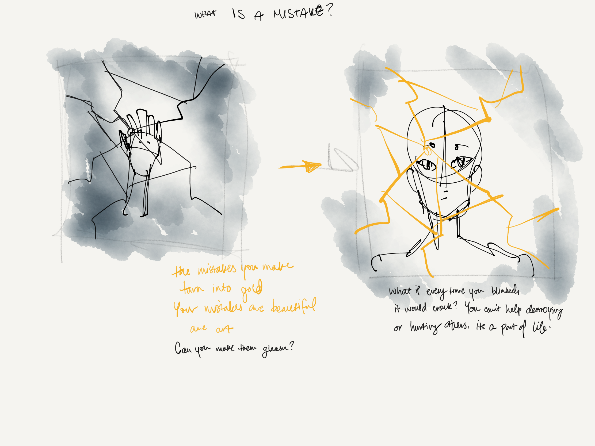

_Unclear_ is an exploration in self-recognition. In meditation, the only way to get a grasp on the Self is through letting go, allowing the changing nature of your experience be the window into what is really going on beneath. _Unclear_ asks the questions; How do you shape yourself? What does seeing yourself mean?

This piece takes on the shape of a vanity, complete with Hollywood-style lights lining the edge of the mirror.
The audience is invited to take a seat at the vanity to face themselves, and are confronted with a truer representation of their inner self; they are shrouded in fog, unfocused, hard to see.

<iframe src="https://player.vimeo.com/video/380874635" width="640" height="360" frameborder="0" allow="autoplay; fullscreen" allowfullscreen></iframe>
In the process of discovering themselves in the mirror, the audience learns that they can clear this fog by "wiping" it away, sweeping the debris out of the frame. However, the further and more fervently they reach, the closer they get to the mirror, and suddenly, it breaks. They themselves have done this, have brought in a new obstacle to seeing. The lens cracks, and while there may be more clarity in certain spots, others become impossible to grasp.

## Process

This piece began with a conversation with my good friend and fellow artist, [Alice](https://aliceyuanzhang.com/). We had been talking about meditation, and how the _self_ within is an elusive concept. Each time you reach for it, it slips out of your grasp - but in never reaching, you never see anything at all. Unseen is a play on that, turning self-reflection from internal to external, a metaphorical fog into a literal one.

<!-- TODO unclear photos, soft -->

I'd been fascinated with half-seen objects and people for a while. But with this new lens of the self, I wanted to ask another question; How does agency affect our sense of self?

Breaking the mirror could be seen as a mistake, but by including it in the piece it becomes intended play. One of my goals was to allow the audience to interact with their internal lens, both trying to clarify it and shaping it in the process.

<!--  -->

<!-- TODO tests with shatter -->
<!--  -->
<!--  -->
<!--  -->
<!--  -->

<!-- TODO carpentering the whole thing -->

_Used in this piece: LeapMotion, TouchDesigner_
